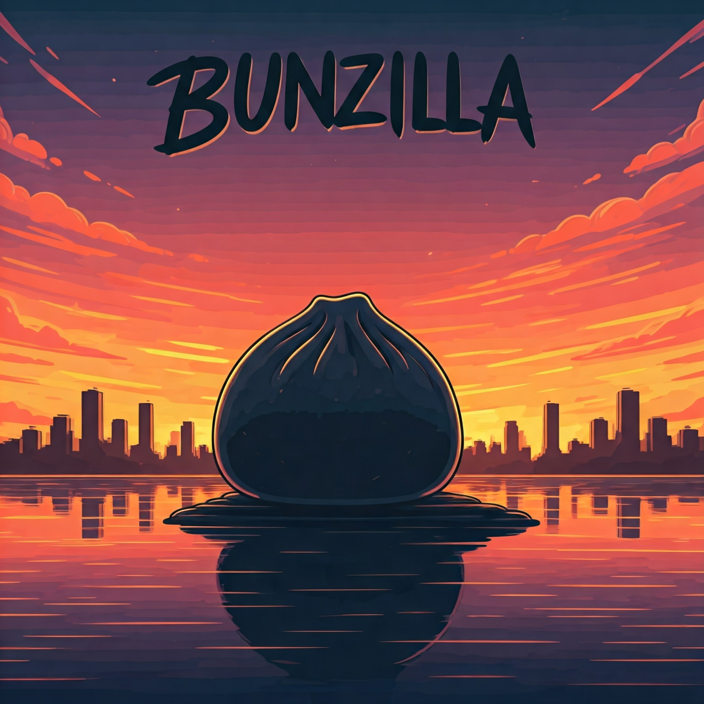

  

    

      
    

    
The Ultimate Bun Project Generator

    

      
      
      
    

  

  

    

      

        

        

        

      

      

        

          $
          bunx bunzilla create my-awesome-app
        

        

          $
          cd my-awesome-app
        

        

          $
          bun dev
        

      

    

  

  

    

      
🎨

      <h3 class="feature-title">Web Apps</h3>
      <ul class="feature-list">
        <li class="feature-item">React, Solid, or Svelte</li>
        <li class="feature-item">TailwindCSS & Shadcn</li>
        <li class="feature-item">TypeScript by Default</li>
        <li class="feature-item">Hot Module Replacement</li>
        <li class="feature-item">SEO Optimized</li>
      </ul>
    

    

      
🚀

      <h3 class="feature-title">API Projects</h3>
      <ul class="feature-list">
        <li class="feature-item">Hono, Fastify, or Express</li>
        <li class="feature-item">Drizzle ORM Integration</li>
        <li class="feature-item">JWT Authentication</li>
        <li class="feature-item">OpenAPI Documentation</li>
        <li class="feature-item">End-to-End Type Safety</li>
      </ul>
    

    

      
📦

      <h3 class="feature-title">Utility Packages</h3>
      <ul class="feature-list">
        <li class="feature-item">NPM Package Ready</li>
        <li class="feature-item">esbuild Pipeline</li>
        <li class="feature-item">Vitest Setup</li>
        <li class="feature-item">Automated Publishing</li>
        <li class="feature-item">TypeScript Config</li>
      </ul>
    

    

      
🏢

      <h3 class="feature-title">Monorepos</h3>
      <ul class="feature-list">
        <li class="feature-item">Workspace Management</li>
        <li class="feature-item">Shared Configurations</li>
        <li class="feature-item">Version Control</li>
        <li class="feature-item">CI/CD Integration</li>
        <li class="feature-item">Cross-Package Testing</li>
      </ul>
    

  

  

    

      

        <h3 class="command-title">Create New Project</h3>
      

      

        

          

            $
            bunzilla create [type] --name my-app [options]
          

        

        
Available options:

        <ul>
          <li><code>--type</code>: webapp | api | utility | monorepo | cli</li>
          <li><code>--frontend</code>: react | solid | svelte</li>
          <li><code>--framework</code>: hono | fastify | express</li>
          <li><code>--defaults</code>: Skip prompts with default values</li>
        </ul>
      

    

    

      

        <h3 class="command-title">Project Evolution</h3>
      

      

        

          

            $
            bunzilla evolve --add cli
          

          

            $
            bunzilla evolve --convert monorepo
          

        

      

    

  

  

    

      <h3 class="evolution-title">Evolution Paths</h3>
      

        
Utility Package

        
CLI Tool

        
Monorepo

      

      

        
API

        
Full Stack

        
Monorepo

      

    

  

  

    <h3>Join the Bunzilla Community</h3>
    
Built with ❤️ by developers, for developers

    

      <a href="https://github.com/yourusername/bunzilla" class="footer-link">GitHub</a>
      <a href="https://discord.gg/bunzilla" class="footer-link">Discord</a>
      <a href="https://twitter.com/bunzilla" class="footer-link">Twitter</a>
    

  

